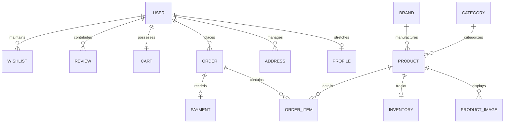
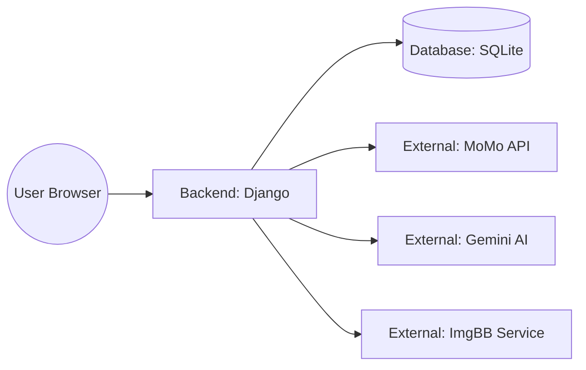
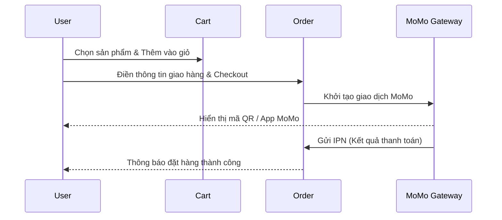
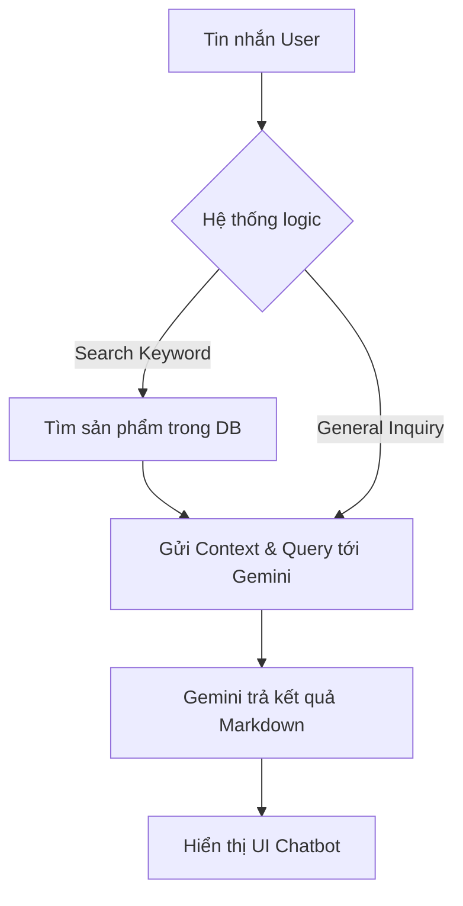

# 💻 LapStore - Website Bán Laptop & Linh Kiện Công Nghệ

[](https://www.djangoproject.com/)
[](https://www.python.org/)
[](https://www.sqlite.org/)
[](https://deepmind.google/technologies/gemini/)
[](https://business.momo.vn/)

---

## 1. 📝 Giới thiệu

### Mô tả hệ thống
**LapStore** là một nền tảng thương mại điện tử chuyên biệt dành cho thị trường máy tính xách tay và linh kiện công nghệ. Hệ thống được thiết kế theo kiến trúc **Monolithic** với Django, tập trung vào khả năng mở rộng, bảo mật và trải nghiệm khách hàng hiện đại.

### Mục đích
Dự án nhằm cung cấp một giải pháp quản lý bán hàng toàn diện, từ khâu giới thiệu sản phẩm, tư vấn tự động bằng trí tuệ nhân tạo (AI) đến quy trình đặt hàng và thanh toán trực tuyến an toàn.

### Điểm nổi bật
- **🤖 Chatbot AI (Gemini Pro)**: Tư vấn cấu hình, so sánh sản phẩm và giải đáp thắc mắc khách hàng 24/7.
- **💳 Cổng thanh toán MoMo**: Tích hợp thanh toán QR Code và App-to-App an toàn.
- **🖼️ Quản lý ảnh ImgBB**: Tự động upload và lưu trữ hình ảnh sản phẩm qua API giúp tối ưu dung lượng server.
- **📦 Cấu hình chi tiết**: Hệ thống phân loại cấu hình Laptop và Linh kiện (CPU, RAM, VGA) cực kỳ chi tiết.

---

## 2. 🚀 Tính năng chính

### 🔐 Quản lý người dùng
- **Xác thực**: Đăng ký, Đăng nhập, Đăng xuất với hệ thống của Django.
- **Hồ sơ cá nhân**: Quản lý thông tin cá nhân, ảnh đại diện, số điện thoại.
- **Địa chỉ nhận hàng**: Hệ thống quản lý nhiều địa chỉ, hỗ trợ chọn địa chỉ mặc định.
- **Phân quyền (RBAC)**: Phân chia rõ rệt vai trò Guest, User, Staff và Admin.

### 🛍️ Quản lý sản phẩm
- **Danh mục đa cấp**: Phân loại theo Laptop, Linh kiện, Phụ kiện.
- **Bộ lọc thông minh**: Lọc theo hãng (Brand), khoảng giá, dung lượng RAM, CPU, GPU.
- **Thông số kỹ thuật**: Hiển thị bảng chi tiết cấu hình (Specs) cho từng loại sản phẩm.
- **Tìm kiếm**: Tìm kiếm Full-text search theo tên và mô tả sản phẩm.

### 🛒 Giỏ hàng & Đơn hàng
- **Giỏ hàng động**: Thêm/sửa số lượng, xóa sản phẩm trực tiếp (Ajax).
- **Mã giảm giá (Coupon)**: Áp dụng coupon kiểm tra tính hợp lệ và thời hạn.
- **Quy trình Checkout**: Thu thập thông tin giao hàng, tính toán tổng tiền sau giảm giá.
- **Quản lý đơn hàng**: Xem lịch sử đơn hàng, cập nhật trạng thái (Pending, Processing, Delivered, Cancelled).

### 💳 Thanh toán
- **Thanh toán MoMo**: Khởi tạo giao dịch, xử lý Redirect và IPN (Instant Payment Notification).
- **COD**: Tùy chọn thanh toán khi nhận hàng truyền thống.
- **Xử lý trạng thái**: Tự động chuyển trạng thái đơn hàng sau khi nhận callback từ cổng thanh toán.

### 🤖 AI chatbot
- **Tư vấn thông minh**: Sử dụng công nghệ Gemini 2.5 Flash để đọc dữ liệu sản phẩm và trả lời khách hàng.
- **Tìm kiếm sản phẩm qua hội thoại**: Gợi ý các sản phẩm đang có trong kho dựa trên nhu cầu người dùng.

### 📊 Dashboard (Admin)
- **Custom Admin Site**: Giao diện quản trị LapStore tùy biến, hiển thị thống kê nhanh.
- **Quản lý kho (Inventory)**: Theo dõi số lượng tồn kho, tự động cập nhật số lượng đã bán.

---

## 3. 🛠️ Công nghệ sử dụng

| Thành phần | Công nghệ | Chi tiết |
| :--- | :--- | :--- |
| **Backend** | Python | Phiên bản 3.10+ |
| **Framework** | Django | Phiên bản 5.x / 6.x |
| **Database** | SQLite | Môi trường phát triển (có thể thay bằng PostgreSQL) |
| **Frontend** | HTML5, CSS3, JS | Vanilla JavaScript, Bootstrap 5, FontAwesome |
| **AI API** | Google Gemini | Mô hình `gemini-2.5-flash` |
| **Payment API** | MoMo Gateway | Môi trường Test (Partner Code, Access Key, Secret Key) |
| **Storage API** | ImgBB | Lưu trữ hình ảnh sản phẩm (image_url) |
| **Task Queue** | SMTP | Gửi mail thông báo qua Gmail |

---

## 4. 📂 Cấu trúc dự án

```text
Laptop_Store/
├── core/                       # 📂 Hệ thống lõi & Điều phối
│   ├── admin.py                # Cấu hình Admin tùy chỉnh
│   ├── apps.py                 # Cấu hình App core
│   ├── context_processors.py   # Xử lý dữ liệu toàn cục cho template
│   ├── models.py               # Profile, Address, Wishlist
│   ├── urls.py                 # Routing chatbot & home
│   └── views.py                # Logic home & Gemini chatbot
├── products/                   # 📂 Quản lý sản phẩm & Kho
│   ├── admin.py                # Quản lý Product, Brand, Category trong Admin
│   ├── models.py               # Product, LaptopConfig, AccessoryConfig...
│   ├── urls.py                 # Shop URL, Search, Product Detail
│   └── views.py                # Logic hiển thị & Tìm kiếm sản phẩm
├── users/                      # 📂 Người dùng & Xác thực
│   ├── forms.py                # Form đăng ký, đăng nhập
│   ├── models.py               # (Sử dụng Django native User)
│   ├── urls.py                 # Login, Register, Profile URLs
│   └── views.py                # Logic Authentication & User Profile
├── orders/                     # 📂 Giỏ hàng, Đơn hàng & Thanh toán
│   ├── services/               #
│   │   ├── email_service.py    # Gửi hóa đơn qua Email
│   │   └── momo_service.py     # Xử lý tích hợp API MoMo
│   ├── models.py               # Order, OrderItem, Coupon, Payment
│   ├── urls.py                 # Cart, Checkout, MoMo returns
│   └── views.py                # Logic Checkout & Callback xử lý
├── webbapp/                    # 📂 Cấu hình thư mục gốc (Django Project)
│   ├── settings.py             # Toàn bộ cấu hình hệ thống & API Keys
│   ├── urls.py                 # Root URL router
│   └── wsgi.py / asgi.py       # Cấu hình deploy server
├── templates/                  # 📂 Giao diện HTML
│   ├── base.html               # Layout chính
│   ├── core/                   # Home, Chatbot UI
│   ├── products/               # Detail, Search results
│   ├── users/                  # Profile, Orders, Login/Register
│   └── orders/                 # Cart, Checkout, Success page
├── .env.example                # File mẫu cấu hình biến môi trường
├── manage.py                   # Command-line quản trị
└── requirements.txt            # Danh sách dependencies
```

---

## 5. ⚙️ Hướng dẫn cài đặt

### Bước 1: Clone dự án
```bash
git clone https://github.com/vuluongvu/PTUD_Python_Nhom07.git
cd Laptop_Store
```

### Bước 2: Khởi tạo môi trường ảo
```bash
python -m venv env
# Windows
.\env\Scripts\activate
# Linux/macOS
source env/bin/activate
```

### Bước 3: Cài đặt thư viện
```bash
pip install -r requirements.txt
```

### Bước 4: Cấu hình mã nguồn (.env)
Tạo file `.env` tại thư mục gốc từ mẫu sau:
```env
SECRET_KEY=django-insecure-...
DEBUG=True

# Email
EMAIL_HOST_USER=your-email@gmail.com
EMAIL_HOST_PASSWORD=your-app-password

# AI & Images
GOOGLE_API_KEY=your-gemini-api-key
IMGBB_API_KEY=your-imgbb-api-key

# MoMo
MOMO_PARTNER_CODE=MOMO...
MOMO_ACCESS_KEY=...
MOMO_SECRET_KEY=...
```

### Bước 5: Chạy Migration & Khởi tạo Admin
```bash
python manage.py makemigrations
python manage.py migrate
python manage.py createsuperuser
```

### Bước 6: Khởi chạy Server
```bash
python manage.py runserver
```
Truy cập: `http://127.0.0.1:8000`

---

## 6. 🌐 Biến môi trường (.env)

| Biến | Ý nghĩa | Ví dụ |
| :--- | :--- | :--- |
| `SECRET_KEY` | Bảo mật Django | `django-insecure-xxxxx` |
| `DEBUG` | Chế độ gỡ lỗi | `True` |
| `GOOGLE_API_KEY` | API Key cho Gemini | `AIzaSyB...` |
| `MOMO_PARTNER_CODE` | Mã đối tác MoMo | `MOMOBKUN20220623` |
| `IMGBB_API_KEY` | API Key cho ImgBB | `f6d89...` |

---

## 7. 👤 Tài khoản mẫu

- **Quản trị viên**: `admin` / `admin123`
- **Người dùng test**: `user_test` / `test12345`

---

## 8. 📊 Mô hình dữ liệu

### Sơ đồ ERD (Entity Relationship Diagram)


### Danh sách các bảng chính
1. **User/Profile**: Lưu trữ thông tin định danh và thông tin cá nhân mở rộng.
2. **Product**: Thông tin cơ bản, giá, trạng thái và mối quan hệ với cấu hình (Laptop/Linh kiện).
3. **Order/OrderItem**: Snapshot thông tin sản phẩm tại thời điểm mua hàng.
4. **Cart/CartItem**: Lưu giữ trạng thái giỏ hành cho người dùng đã đăng nhập.
5. **Address**: Quản lý thông tin giao hàng phân cấp (Tỉnh -> Huyện -> Xã).

---

## 9. 🛡️ Phân quyền (RBAC)

| Quyền hạn | Guest | User | Admin/Staff |
| :--- | :---: | :---: | :---: |
| Xem sản phẩm | ✅ | ✅ | ✅ |
| Tìm kiếm/Lọc | ✅ | ✅ | ✅ |
| Chat với AI | ✅ | ✅ | ✅ |
| Quản lý Wishlist | ❌ | ✅ | ✅ |
| Thanh toán MoMo | ❌ | ✅ | ✅ |
| Quản lý kho hàng | ❌ | ❌ | ✅ |
| Duyệt đơn hàng | ❌ | ❌ | ✅ |

---

## 10. 🔌 API Endpoints

| Method | Endpoint | Description |
| :--- | :--- | :--- |
| **POST** | `/chatbot/api/` | Gửi tin nhắn đến Gemini AI |
| **POST** | `/api/get-default-address/` | Lấy địa chỉ mặc định của User |
| **POST** | `/toggle-cart/` | Thêm/Xóa sản phẩm khỏi giỏ hàng |
| **POST** | `/momo/ipn/` | Webhook nhận thông báo từ MoMo |
| **GET** | `/search-results/` | API tìm kiếm và lọc sản phẩm |

---

## 11. ⚠️ Mã lỗi HTTP

| Code | Ý nghĩa | Trường hợp xảy ra |
| :--- | :--- | :--- |
| `200` | OK | Xử lý thành công (giỏ hàng, chatbot) |
| `302` | Found | Redirect sau khi Login/Logout |
| `401` | Unauthorized | Truy cập vào Checkout khi chưa đăng nhập |
| `403` | Forbidden | Lỗi Token CSRF khi gửi Form |
| `404` | Not Found | Sản phẩm đã bị xóa hoặc sai Slug |
| `500` | Server Error | Lỗi cấu hình API Key hoặc lỗi logic Python |

---

## 12. 🔄 Quy trình nghiệp vụ

### 📐 Kiến trúc hệ thống


### 🛒 Luồng mua hàng (Purchase Workflow)


---

## 13. 🧠 Luồng xử lý AI (Gemini Chatbot)



---

## 14. 🧪 Testing

Để chạy các bản kiểm thử tự động, sử dụng lệnh:
```bash
python manage.py test
```
**Các module được test trọng tâm:**
- Kiểm tra tính đúng đắn của việc tính toán giá trong `OrderItem`.
- Kiểm tra logic áp dụng mã giảm giữ trong `orders/views.py`.
- Mocking Gemini API response trong `core/tests.py`.

---

## 15. 🛠️ Cấu hình nâng cao

### Sử dụng ngrok cho MoMo Callback
Cổng thanh toán MoMo cần một URL công khai để gửi IPN. Khi phát triển local, bạn cần dùng **ngrok**:
1. Chạy ngrok: `ngrok http 8000`
2. Copy URL ngrok (ví dụ: `https://abcd-123.ngrok.io`)
3. Cập nhật vào `.env`:
   ```env
   MOMO_IPN_URL=https://abcd-123.ngrok.io/momo/ipn/
   ```

---

**© 2026 LapStore Team - Nhóm 07 - PTUD_Python**
